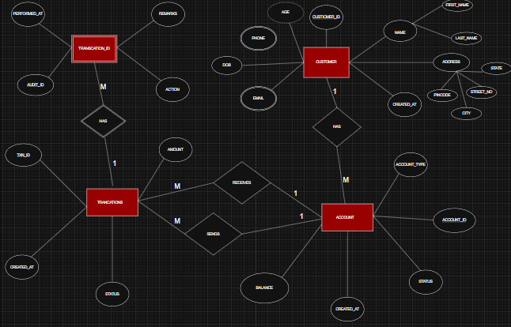

🏦 Banking Transaction Management System

📌 Project Overview

This project is a DBMS-based Core Banking System designed and implemented from ER modeling to ACID-compliant transaction processing using MySQL and Python.

It simulates how real-world banking backend systems work by handling customer onboarding, account management, secure monetary transactions, audit logging, and reporting.

⚠️ This system represents an internal bank/admin backend, not a customer-facing application.

🧠 System Design Philosophy
🔹 Admin / Backend-Oriented System

The application is designed as an internal banking system operated by:

Bank staff

Administrators

Backend services

End-users (customers) typically interact with mobile/web apps, which internally call such systems.

This separation reflects real banking architecture.

🗂️ Entity Relationship (ER) Diagram

The system is designed based on a normalized ER model with strong referential integrity and role-based relationships.

📊 ER Diagram

📁 Place the image file in the root of the repository:

🔹 ER Highlights

Customer → Account (1:M)

Account → Transaction (SENDS / RECEIVES)

Transaction → Transaction_Audit (Weak Entity)

Composite attributes (Name, Address)

Derived attribute (Age from DOB)

ACID-oriented transaction design

🧱 Database Schema

>customers

>accounts

>transactions

>transaction_audit

Key DBMS Features

>Primary & Foreign Keys

>CHECK constraints (e.g., balance ≥ 0)

>Role-based transaction modeling

>Soft deletes using account status

>Weak entity implementation

🔄 Core Functionalities

👨‍💼 Admin / Bank Operations

>Create Customer

>Create Account

>Block / Unblock Account

>Close Account (Soft Close)

💳 Account Operations

>Deposit Money

>Withdraw Money

>Transfer Funds

>Check Balance

📊 Reporting

>Transaction History

>Monthly Statement (Credits, Debits, Opening & Closing Balance)

| Account Status | Allowed Operations          |
| -------------- | --------------------------- |
| ACTIVE         | Deposit, Withdraw, Transfer |
| BLOCKED        | Balance Check, History      |
| CLOSED         | Balance Check, History      |
